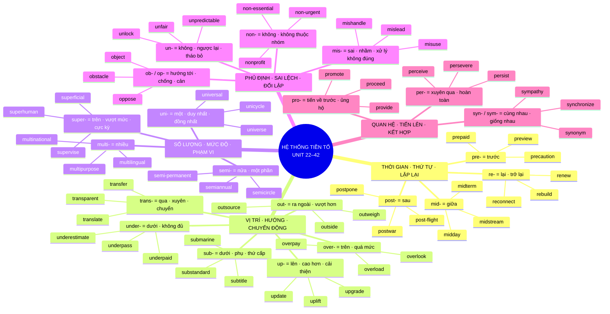

# Sơ đồ hệ thống tiền tố — Unit 22–42

> Phạm vi xác nhận: 21 nhóm **tiền tố (prefixes)** Unit 22–42 trong
> `VOCABULARY_STATE.csv` và
> `WORD_FORMATION_ADDENDUM_Units_22-34.md`. Nguồn đầy đủ Unit 01–21 hiện
> không có trong workspace, vì vậy tài liệu này không suy đoán hoặc tự bổ sung
> các Unit đó.
>
> **Phân biệt thuật ngữ:** tài liệu này chỉ hệ thống hóa **tiền tố** — thành
> phần đứng trước một từ hoặc thân từ để thay đổi nghĩa. **Gốc từ (roots)** là
> giai đoạn học tiếp theo và sẽ được xây dựng trong một tài liệu riêng. Các từ
> hỗ trợ như `form`, `root`, `hold`, `grade` xuất hiện trong ví dụ không được
> xem là các nhánh tiền tố mới.

## 1. Bản đồ tư duy tổng thể



## 2. Cây hệ thống dạng chữ

```text
HỆ THỐNG TIỀN TỐ — UNIT 22–42
│
├── A. THỜI GIAN · THỨ TỰ · LẶP LẠI
│   ├── Unit 22: mid-  → giữa / giữa chừng
│   │   ├── midday, midnight, midweek
│   │   └── midterm, midpoint, midstream
│   ├── Unit 31: pre-  → trước / chuẩn bị trước
│   │   ├── prepaid, preorder, pre-book
│   │   └── preview, pretest, preheat, precaution
│   ├── Unit 30: post- → sau / hậu-
│   │   ├── postwar, post-flight, post-match
│   │   └── postpone → postponement
│   └── Unit 33: re-   → lại / trở lại
│       ├── rebuild, rewrite, reconnect, refill
│       └── renew → renewal; recycle → recyclable
│
├── B. VỊ TRÍ · HƯỚNG · CHUYỂN ĐỘNG
│   ├── Unit 27: out-   → ra ngoài / vượt hơn
│   ├── Unit 28: over-  → phía trên / quá mức
│   ├── Unit 35: sub-   → dưới / phụ / thứ cấp
│   ├── Unit 38: trans- → qua / xuyên / chuyển đổi
│   ├── Unit 40: under- → bên dưới / dưới mức cần thiết
│   └── Unit 42: up-    → đi lên / nâng cao / cải thiện
│
├── C. SỐ LƯỢNG · MỨC ĐỘ · PHẠM VI
│   ├── Unit 24: multi- → nhiều
│   ├── Unit 34: semi-  → một nửa / một phần
│   ├── Unit 36: super- → trên / vượt mức / cực kỳ
│   └── Unit 41: uni-   → một / duy nhất / đồng nhất
│
├── D. PHỦ ĐỊNH · SAI LỆCH · ĐỐI LẬP
│   ├── Unit 23: mis-     → sai / nhầm / làm không đúng
│   ├── Unit 25: non-     → không / không thuộc nhóm
│   ├── Unit 39: un-      → không / đối lập / tháo bỏ
│   └── Unit 26: ob-/op-  → hướng tới / chống lại / cản trở
│
└── E. QUAN HỆ · TIẾN LÊN · KẾT HỢP
    ├── Unit 29: per-      → xuyên qua / hoàn toàn; học theo họ từ
    ├── Unit 32: pro-      → tiến về trước / ủng hộ / cung cấp
    └── Unit 37: syn-/sym- → cùng nhau / giống nhau
```

## 3. Chi tiết từng nhánh

### A. Thời gian, thứ tự và sự lặp lại

#### Unit 22 — `mid-`: giữa, ở giữa, giữa chừng

- `midday`: giữa trưa.
- `midnight`: nửa đêm.
- `midterm`: giữa kỳ.
- `midweek`: giữa tuần.
- `midpoint`: điểm giữa.
- `midstream`: giữa một quá trình đang diễn ra.

Ví dụ ghi nhớ:

- `We changed the requirements midstream.` — Chúng tôi thay đổi yêu cầu giữa chừng.
- `The midterm exam is next week.` — Bài thi giữa kỳ diễn ra vào tuần sau.

#### Unit 31 — `pre-`: trước, làm trước, chuẩn bị trước

- `prepaid`: trả tiền trước khi dùng.
- `preorder`: đặt một sản phẩm trước khi phát hành.
- `pre-book`: đặt trước chỗ hoặc dịch vụ.
- `preview`: xem trước nội dung.
- `pretest`: bài kiểm tra trước giai đoạn học chính.
- `preheat`: làm nóng trước.
- `precaution`: biện pháp thực hiện trước để tránh rủi ro.

Ví dụ ghi nhớ:

- `prepaid card` — thẻ trả trước.
- `preorder a new phone` — đặt điện thoại trước ngày phát hành.
- `take safety precautions` — thực hiện các biện pháp phòng ngừa.

#### Unit 30 — `post-`: sau, hậu-

- `postwar`: sau chiến tranh.
- `post-flight`: sau chuyến bay.
- `post-match`: sau trận đấu.
- `post-crisis`: sau khủng hoảng.
- `post-paid`: trả tiền sau khi dùng.
- `postpone`: trì hoãn; `postponement`: sự trì hoãn.
- `postscript`: phần ghi thêm ở cuối thư hoặc thông điệp.

Đối chiếu:

- `prepaid` ↔ `post-paid`: trả trước ↔ trả sau.
- `postpone` là động từ; `postponement` là danh từ.

#### Unit 33 — `re-`: lại, trở lại, phục hồi

- `rebuild`: xây dựng lại.
- `rewrite`: viết lại.
- `reorganize`: tổ chức lại.
- `reconnect`: kết nối lại.
- `refill`: làm đầy lại.
- `reuse`: sử dụng lại.
- `renew`: gia hạn; `renewal`: sự gia hạn.
- `recycle`: tái chế; `recyclable`: có thể tái chế.
- `return`: trả lại; `refund`: hoàn tiền.

Ví dụ ghi nhớ:

- `renew a subscription` — gia hạn gói đăng ký.
- `refund the payment` — hoàn lại khoản tiền.
- `rewrite the report` — viết lại báo cáo.

### B. Vị trí, hướng và sự chuyển động

#### Unit 27 — `out-`: ra ngoài, vượt ra, hơn hẳn

- `outside`: bên ngoài.
- `outsource`: thuê bên ngoài thực hiện công việc.
- `outweigh`: quan trọng hoặc lớn hơn.
- `output`: đầu ra, lượng sản xuất.
- `outgrow`: lớn đến mức không còn phù hợp.
- `outskirts`: vùng ngoại ô.
- `outbreak`: sự bùng phát bệnh hoặc bạo lực.
- `outburst`: sự bộc phát cảm xúc.

Đối chiếu:

- `flu outbreak` — dịch cúm bùng phát.
- `angry outburst` — cơn bộc phát tức giận.
- `Benefits outweigh costs.` — Lợi ích lớn hơn chi phí.

#### Unit 28 — `over-`: ở trên, vượt quá, quá mức

- `overpay`: trả quá nhiều tiền.
- `overcharge`: tính giá quá cao.
- `overestimate`: ước tính quá cao.
- `overload`: làm quá tải.
- `overreact`: phản ứng quá mức.
- `oversleep`: ngủ quá giờ.
- `overspend`: chi tiêu quá mức.
- `overlook`: bỏ sót, không nhận ra.

Ví dụ ghi nhớ:

- `Compare prices so you do not overpay.`
- `Do not overload the server.`
- `The reviewer overlooked a small error.`

#### Unit 35 — `sub-`: dưới, thấp hơn, phụ, thứ cấp

- `submarine`: tàu hoạt động dưới nước.
- `submerge`: nhấn chìm hoặc đi xuống dưới mặt nước.
- `subway`: tàu điện ngầm hoặc đường hầm.
- `subtitle`: chữ phụ hoặc bản dịch trên màn hình.
- `subheading`: tiêu đề phụ dưới tiêu đề chính.
- `substandard`: dưới tiêu chuẩn.
- `subordinate`: người hoặc vị trí cấp dưới.
- `substitute`: thay thế; `substitution`: sự thay thế.
- `suburb`: vùng ngoại ô; `suburban`: thuộc ngoại ô.

#### Unit 38 — `trans-`: qua, xuyên qua, chuyển từ trạng thái này sang trạng thái khác

- `transfer`: chuyển người, tiền hoặc dữ liệu.
- `transit`: đi qua một nơi.
- `transition`: sự chuyển đổi giữa hai giai đoạn.
- `translate`: dịch; `translation`: bản dịch; `translator`: người dịch.
- `transport`: vận chuyển.
- `transmit`: truyền tín hiệu, thông tin hoặc bệnh.
- `transcribe`: chép lại lời nói thành chữ.
- `transparent`: minh bạch; `transparency`: sự minh bạch; `transparently`: một cách minh bạch.

#### Unit 40 — `under-`: ở dưới, thấp hơn, không đủ

- `underground`: dưới mặt đất.
- `underpass`: lối đi bên dưới đường hoặc đường ray.
- `underwater`: dưới nước.
- `underpaid`: được trả lương thấp hơn mức hợp lý.
- `understaffed`: thiếu nhân sự.
- `undercharge`: tính giá thấp hơn mức cần thiết.
- `underestimate`: ước tính số lượng hoặc mức độ quá thấp.
- `underrate`: đánh giá năng lực hoặc giá trị quá thấp.
- `understate`: nói giảm mức độ nghiêm trọng.
- `understatement`: lời nói làm sự việc có vẻ nhẹ hơn thực tế.

Đối chiếu:

- `underestimate the cost` — ước tính chi phí quá thấp.
- `underrate an employee` — đánh giá thấp năng lực nhân viên.
- `Calling the outage minor is an understatement.`

#### Unit 42 — `up-`: lên, cao hơn, cải thiện, hoàn tất

- `update`: làm thông tin hoặc hồ sơ trở nên hiện hành.
- `upgrade`: nâng cấp lên phiên bản tốt hơn.
- `uplift`: nâng lên hoặc cải thiện tinh thần.
- `upbringing`: cách một đứa trẻ được nuôi dạy.
- `upset`: buồn, lo hoặc làm ai đó buồn.
- `upstairs`: ở tầng trên.
- `upcoming`: sắp diễn ra.
- `upstream`: ngược dòng hoặc ở khâu trước của một luồng.
- `uproot`: nhổ tận gốc hoặc buộc rời khỏi nơi ở.
- `upkeep`: việc hoặc chi phí bảo trì.
- `uphold`: duy trì, bảo vệ một nguyên tắc hoặc quyết định.
- `upturn`: sự cải thiện hoặc tăng trưởng.

Ba động từ cần tách rõ:

```text
update records     → làm hồ sơ mới và chính xác
upgrade a system   → nâng hệ thống lên phiên bản tốt hơn
uphold a decision  → duy trì hoặc bảo vệ một quyết định
```

### C. Số lượng, mức độ và phạm vi

#### Unit 24 — `multi-`: nhiều

- `multiple`: nhiều hơn một.
- `multipurpose`: có nhiều mục đích sử dụng.
- `multitask`: thực hiện nhiều nhiệm vụ cùng lúc.
- `multicultural`: gồm nhiều nền văn hóa.
- `multilingual`: sử dụng nhiều ngôn ngữ.
- `multinational`: hoạt động tại nhiều quốc gia.
- `multiplayer`: dành cho nhiều người chơi.

#### Unit 34 — `semi-`: một nửa, một phần, chưa hoàn toàn

- `semicircle`: hình bán nguyệt; `semicircular`: có hình bán nguyệt.
- `semifinal`: vòng bán kết.
- `semisweet`: hơi ngọt, không quá ngọt.
- `semiconscious`: nửa tỉnh nửa mê.
- `semiformal`: bán trang trọng.
- `semiannual`: hai lần mỗi năm hoặc mỗi sáu tháng.
- `semi-permanent`: lâu dài nhưng không vĩnh viễn.
- `semiautomatic`: một phần tự động.

Đối chiếu:

- `a semicircle` — danh từ chỉ hình.
- `a semicircular table` — tính từ mô tả chiếc bàn.

#### Unit 36 — `super-`: ở trên, vượt mức bình thường, cực kỳ

- `superhuman`: vượt quá khả năng bình thường của con người.
- `superpower`: cường quốc hoặc siêu năng lực.
- `supercharge`: tăng mạnh năng lượng hoặc hiệu suất.
- `supermarket`: siêu thị.
- `supercomputer`: siêu máy tính.
- `supervise`: giám sát; `supervision`: sự giám sát; `supervisor`: người giám sát.
- `superficial`: hời hợt; `superficially`: một cách hời hợt; `superficiality`: sự hời hợt.

#### Unit 41 — `uni-`: một, duy nhất, đồng nhất

- `unicycle`: xe đạp một bánh.
- `uniform`: đồng phục hoặc đồng nhất.
- `uniformity`: sự đồng nhất.
- `universe`: vũ trụ.
- `universal`: áp dụng cho mọi người hoặc mọi nơi.
- `unicellular`: đơn bào.
- `unilateral`: do một phía thực hiện.
- `unison`: đồng thanh hoặc đồng thời.

Mạng từ loại quan trọng:

```text
universe      = danh từ: vũ trụ
universal     = tính từ: phổ quát
uniformity    = danh từ: sự đồng nhất
unilateral    = tính từ: đơn phương
```

### D. Phủ định, sai lệch và đối lập

#### Unit 23 — `mis-`: sai, nhầm, thực hiện không đúng

- `misunderstand`: hiểu nhầm.
- `misread`: đọc nhầm.
- `mishear`: nghe nhầm.
- `misspell`: đánh vần sai.
- `miscount`: đếm sai.
- `misuse`: sử dụng sai cách hoặc sai mục đích.
- `mislead`: làm người khác tin điều sai.
- `mishandle`: xử lý kém hoặc không đúng.
- `mismatch`: sự không khớp.
- `misbehave`: cư xử không đúng.

#### Unit 25 — `non-`: không, không có, không thuộc nhóm được nêu

- `nonprofit`: phi lợi nhuận.
- `nonfiction`: tác phẩm dựa trên sự thật.
- `nonverbal`: không dùng lời nói.
- `non-smoking`: không hút thuốc hoặc cấm hút thuốc.
- `non-essential`: không thiết yếu.
- `non-urgent`: không khẩn cấp.
- `nonstop`: không dừng.

Đối chiếu:

- `non-essential feature`: có thể bỏ mà chức năng chính vẫn hoạt động.
- `non-urgent issue`: vấn đề có thể chờ, không cần xử lý ngay.

#### Unit 39 — `un-`: không, trái ngược, đảo ngược hoặc loại bỏ

- `uncertain`: không chắc chắn; `uncertainty`: sự không chắc chắn; `uncertainly`: một cách không chắc chắn.
- `unfair`: bất công; `unfairly`: một cách bất công; `unfairness`: sự bất công.
- `unpleasant`: khó chịu; `unpleasantness`: sự khó chịu.
- `unpredictable`: khó dự đoán; `unpredictability`: tính khó dự đoán.
- `unlock`: mở khóa.
- `uncover`: phát hiện hoặc làm lộ ra.
- `unsafe`: không an toàn.
- `unreliable`: không đáng tin cậy.
- `unnecessary`: không cần thiết.

Hai mạng từ loại cần nhớ:

```text
unfair       adjective  → an unfair policy
unfairly     adverb     → treat someone unfairly
unfairness   noun       → the unfairness of the policy

uncertain      adjective → an uncertain result
uncertainly    adverb    → answer uncertainly
uncertainty    noun      → economic uncertainty
unpredictable adjective  → unpredictable demand
```

#### Unit 26 — `ob-` / `op-`: hướng tới, chống lại, đứng cản phía trước

Nhóm này nên học theo từ hoàn chỉnh và ngữ cảnh, không dịch máy móc tiền tố:

- `object`: phản đối.
- `objection`: sự phản đối.
- `oppose`: chống lại.
- `obstacle`: vật hoặc vấn đề cản trở.
- `obstruct`: chặn, gây cản trở.
- `obligatory`: bắt buộc.
- `obvious`: rõ ràng.
- `observe`: quan sát.
- `observant`: giỏi nhận ra chi tiết.
- `observable`: có thể nhìn thấy hoặc đo được.
- `objective`: khách quan.

### E. Quan hệ, tiến lên và kết hợp

#### Unit 29 — `per-`: xuyên qua, hoàn toàn; nhiều từ phải học theo họ từ

- `perceive`: nhận thức; `perception`: nhận thức hoặc ấn tượng; `perceptive`: tinh ý.
- `perfect`: hoàn hảo; `perfection`: sự hoàn hảo; `perfectionism`: tính cầu toàn.
- `persevere`: kiên trì vượt khó; `perseverance`: sự kiên trì.
- `persist`: tiếp tục tồn tại; `persistent`: dai dẳng hoặc bền bỉ.
- `persuade`: thuyết phục; `persuasive`: có sức thuyết phục.
- `permanent`: lâu dài, không tạm thời.
- `perspective`: góc nhìn.

Đối chiếu quan trọng:

- `perceptive person` — người tinh ý.
- `observable result` — kết quả có thể đo thấy.
- `persuasive presentation` — bài trình bày có sức thuyết phục.
- `public perception` — cách công chúng nhìn nhận.
- `customer perspective` — góc nhìn của khách hàng.

#### Unit 32 — `pro-`: tiến về trước, ủng hộ, cung cấp

- `proceed`: tiếp tục thực hiện.
- `progress`: tiến bộ hoặc sự tiến triển.
- `promote`: thúc đẩy hoặc thăng chức.
- `promotion`: sự thăng chức hoặc hoạt động quảng bá.
- `promotional`: mang tính quảng bá.
- `protect`: bảo vệ; `protection`: sự bảo vệ; `protective`: có tác dụng bảo vệ.
- `provide`: cung cấp; `provision`: nguồn cung hoặc điều khoản chuẩn bị trước.
- `profound`: sâu sắc; `profoundly`: một cách sâu sắc; `profundity`: sự sâu sắc.
- `proactive`: chủ động trước khi vấn đề xảy ra.
- `prohibit`: chính thức cấm.

#### Unit 37 — `syn-` / `sym-`: cùng nhau, giống nhau, kết hợp

- `synchronize`: đồng bộ; `synchronization`: sự đồng bộ hóa.
- `synonym`: từ đồng nghĩa; `synonymous`: có nghĩa tương đương.
- `sympathy`: sự cảm thông; `sympathetic`: biết cảm thông; `sympathize`: cảm thông.
- `symphony`: bản giao hưởng; `symphonic`: thuộc giao hưởng.
- `symbiotic`: cộng sinh, đôi bên cùng có lợi.
- `symmetry`: sự đối xứng.
- `synthesis`: sự tổng hợp.
- `syndrome`: một nhóm triệu chứng; `symptom`: một triệu chứng riêng lẻ.

## 4. Mạng lưới đối chiếu nhanh

```text
THỜI GIAN
pre-  ───────── trước ───────── post-
prepaid                           post-paid
pretest                           post-match

MỨC ĐỘ
under- ───── thấp / thiếu ───── over-
underestimate                     overestimate
undercharge                       overcharge

SỐ LƯỢNG
uni- ───────── semi- ───────── multi-
một              một phần          nhiều

VỊ TRÍ
sub- ───────── dưới ───────── super-
subordinate                        supervisor
substandard                        superhuman

THAY ĐỔI
re- = làm lại        trans- = chuyển qua        up- = nâng lên
rewrite              transfer                  upgrade
reconnect            transition                uplift

PHỦ ĐỊNH / SAI
mis- = làm sai       non- = không thuộc nhóm   un- = không / đảo ngược
misuse               nonprofit                 unfair
mislead              non-urgent                unlock
```

## 5. Các cụm cần thuộc như một khối

- `change requirements midstream`
- `mislead customers`
- `multipurpose tool`
- `non-urgent issue`
- `observable improvement`
- `flu outbreak` / `angry outburst`
- `overpay for a service`
- `perceptive analyst`
- `post-flight inspection`
- `prepaid plan`
- `proceed with the plan`
- `provide resources` / `contract provision`
- `renew a subscription`
- `semicircular table`
- `submit a report`
- `under the supervision of a supervisor`
- `automatic synchronization`
- `transparent policy` / `report transparently`
- `economic uncertainty`
- `understaffed team`
- `universal principle`
- `update records` / `upgrade software` / `uphold standards`

## 6. Quy tắc sử dụng sơ đồ tiền tố

1. Nhìn nhánh lớn để đoán ý chung của tiền tố.
2. Kiểm tra loại từ cần dùng: noun, verb, adjective hay adverb.
3. Ghép từ thành cụm tự nhiên thay vì học một bản dịch rời.
4. Với `ob-/op-`, `per-`, và một số từ `pro-`, ưu tiên học toàn bộ từ và họ từ;
   không ép mọi từ vào một phép dịch tiền tố duy nhất.
5. Với các nhóm Recovery, luôn nhớ cả ba lớp: nghĩa, loại từ và collocation.

## 7. Ranh giới với phần gốc từ tiếp theo

```text
GIAI ĐOẠN HIỆN TẠI
Tiền tố + từ/thân từ → ý nghĩa mới
pre- + paid          → prepaid
re-  + write         → rewrite
under- + estimate    → underestimate

GIAI ĐOẠN TIẾP THEO
Gốc từ + tiền tố/hậu tố → mạng họ từ
Ví dụ mô hình: root → derived words → word families → collocations
```

Dữ liệu gốc từ đã bắt đầu được nhập từ Unit 43 với gốc `act`. Gốc này được
quản lý trong tài liệu riêng, không trộn vào 21 nhánh tiền tố Unit 22–42.
Sơ đồ gốc từ nên tổ chức theo:

1. Ý nghĩa cốt lõi của gốc từ.
2. Các biến thể chính tả của gốc.
3. Tiền tố và hậu tố có thể gắn vào gốc.
4. Họ từ tạo thành và loại từ của từng thành viên.
5. Collocation và các cặp dễ nhầm.

---

Nguồn: `VOCABULARY_STATE.csv`, `WORD_FORMATION_ADDENDUM_Units_22-34.md`,
`ROTATION_STATE.md`, và `RECOVERY_PRIORITIES_2026-09-24.md`.
