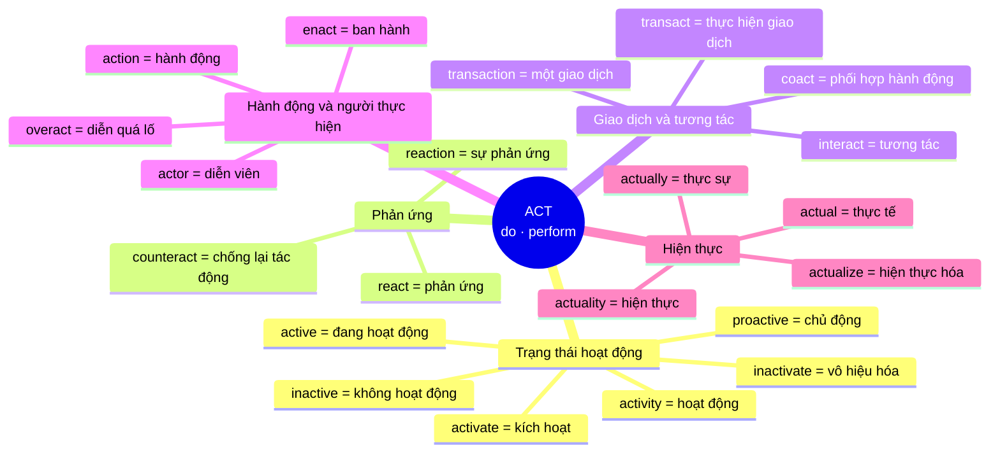

# Sơ đồ hệ thống gốc từ — từ Unit 43

> Giai đoạn gốc từ bắt đầu tại Unit 43, sau chuỗi tiền tố Unit 22–42. Tài liệu
> này không trộn các tiền tố thành nhánh gốc từ; tiền tố và hậu tố chỉ xuất hiện
> như thành phần kết hợp với một gốc.

## Unit 43 — Root `act`

Ý nghĩa cốt lõi: **do, perform, drive an action** — làm, thực hiện, hành động.



## Cây cấu tạo

```text
ACT = làm / hành động
│
├── active family
│   ├── active (adj)       đang hoạt động
│   ├── inactive (adj)     không hoạt động
│   ├── activate (v)       kích hoạt
│   ├── inactivate (v)     vô hiệu hóa
│   ├── activity (n)       hoạt động
│   └── proactive (adj)    chủ động
│
├── react family
│   ├── react (v)          phản ứng
│   ├── reaction (n)       sự phản ứng
│   └── counteract (v)     chống lại / giảm tác động
│
├── transact family
│   ├── transact (v)       thực hiện giao dịch
│   └── transaction (n)    giao dịch
│
├── action family
│   ├── action (n)         hành động
│   ├── actor (n)          diễn viên
│   ├── enact (v)          ban hành
│   ├── interact (v)       tương tác
│   ├── overact (v)        diễn quá lố
│   └── coact (v)          phối hợp hành động
│
└── actual family
    ├── actual (adj)       thực tế
    ├── actually (adv)     thực sự / trên thực tế
    ├── actualize (v)      hiện thực hóa
    └── actuality (n)      hiện thực
```

## Cụm ví dụ

- `an inactive account` — một tài khoản không hoạt động.
- `activate the new feature` — kích hoạt tính năng mới.
- `react to customer feedback` — phản ứng trước phản hồi khách hàng.
- `a strong emotional reaction` — một phản ứng cảm xúc mạnh.
- `transact business online` — thực hiện giao dịch trực tuyến.
- `verify every transaction` — xác minh từng giao dịch.
- `take immediate action` — hành động ngay lập tức.
- `enact a new law` — ban hành luật mới.
- `interact with users` — tương tác với người dùng.
- `counteract the negative effect` — chống lại tác động tiêu cực.
- `the actual cost` — chi phí thực tế.
- `actually reduce costs` — thực sự giảm chi phí.
- `actualize an idea` — hiện thực hóa một ý tưởng.

## Đối chiếu loại từ

```text
inactive (adj)   ≠ inactivate (v)
active (adj)     ≠ activate (v)      ≠ activity (n)
react (v)        ≠ reaction (n)
transact (v)     ≠ transaction (n)
actual (adj)     ≠ actually (adv)    ≠ actuality (n) ≠ actualize (v)
```

`proactive` đã có trong Unit 32 nên được liên kết sang họ `act`, không tạo
thêm một mục trùng trong ngân hàng từ vựng.
