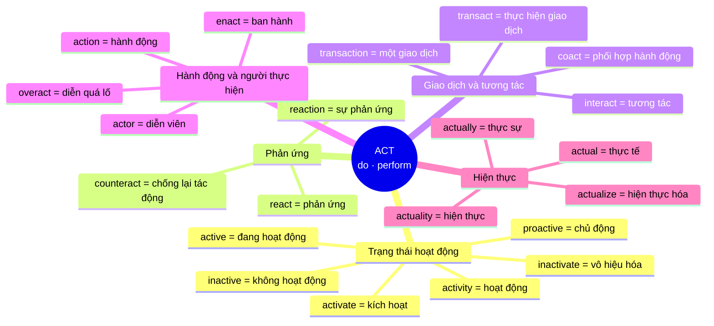
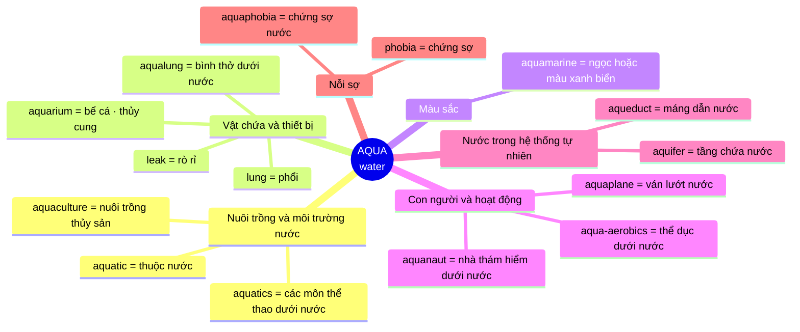
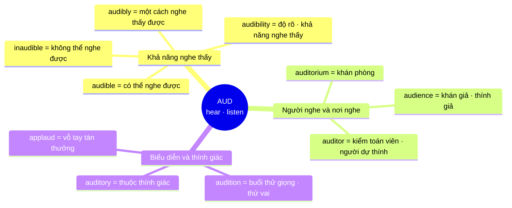
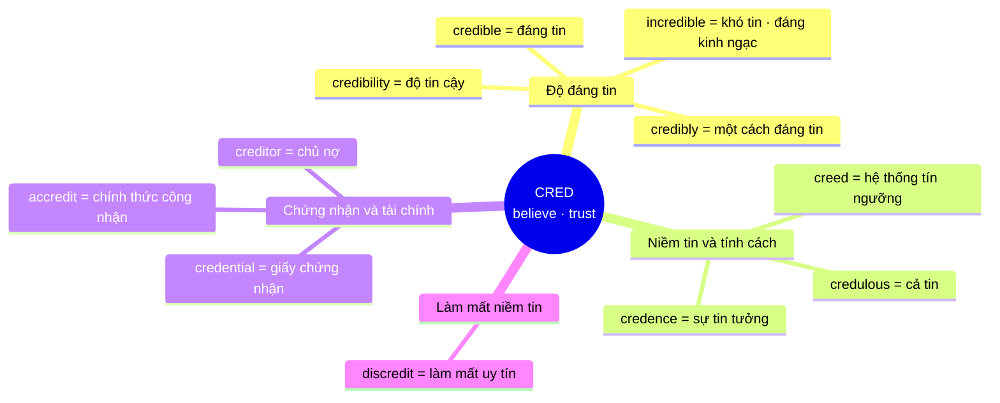

# Sơ đồ hệ thống gốc từ — từ Unit 43

> Giai đoạn gốc từ bắt đầu tại Unit 43, sau chuỗi tiền tố Unit 22–42. Tài liệu
> này không trộn các tiền tố thành nhánh gốc từ; tiền tố và hậu tố chỉ xuất hiện
> như thành phần kết hợp với một gốc.

## Unit 43 — Root `act`

Ý nghĩa cốt lõi: **do, perform, drive an action** — làm, thực hiện, hành động.


```mermaid
mindmap
  root((ACT<br/>do · perform))
    Trạng thái hoạt động
      active = đang hoạt động
      inactive = không hoạt động
      activate = kích hoạt
      inactivate = vô hiệu hóa
      activity = hoạt động
      proactive = chủ động
    Phản ứng
      react = phản ứng
      reaction = sự phản ứng
      counteract = chống lại tác động
    Giao dịch và tương tác
      transact = thực hiện giao dịch
      transaction = một giao dịch
      interact = tương tác
      coact = phối hợp hành động
    Hành động và người thực hiện
      action = hành động
      actor = diễn viên
      enact = ban hành
      overact = diễn quá lố
    Hiện thực
      actual = thực tế
      actually = thực sự
      actualize = hiện thực hóa
      actuality = hiện thực
```

## Cây cấu tạo

```text
ACT = làm / hành động
│
├── active family
│   ├── active (adj)       đang hoạt động
│   ├── inactive (adj)     không hoạt động
│   ├── activate (v)       kích hoạt
│   ├── inactivate (v)     vô hiệu hóa
│   ├── activity (n)       hoạt động
│   └── proactive (adj)    chủ động
│
├── react family
│   ├── react (v)          phản ứng
│   ├── reaction (n)       sự phản ứng
│   └── counteract (v)     chống lại / giảm tác động
│
├── transact family
│   ├── transact (v)       thực hiện giao dịch
│   └── transaction (n)    giao dịch
│
├── action family
│   ├── action (n)         hành động
│   ├── actor (n)          diễn viên
│   ├── enact (v)          ban hành
│   ├── interact (v)       tương tác
│   ├── overact (v)        diễn quá lố
│   └── coact (v)          phối hợp hành động
│
└── actual family
    ├── actual (adj)       thực tế
    ├── actually (adv)     thực sự / trên thực tế
    ├── actualize (v)      hiện thực hóa
    └── actuality (n)      hiện thực
```

## Cụm ví dụ

- `an inactive account` — một tài khoản không hoạt động.
- `activate the new feature` — kích hoạt tính năng mới.
- `react to customer feedback` — phản ứng trước phản hồi khách hàng.
- `a strong emotional reaction` — một phản ứng cảm xúc mạnh.
- `transact business online` — thực hiện giao dịch trực tuyến.
- `verify every transaction` — xác minh từng giao dịch.
- `take immediate action` — hành động ngay lập tức.
- `enact a new law` — ban hành luật mới.
- `interact with users` — tương tác với người dùng.
- `counteract the negative effect` — chống lại tác động tiêu cực.
- `the actual cost` — chi phí thực tế.
- `actually reduce costs` — thực sự giảm chi phí.
- `actualize an idea` — hiện thực hóa một ý tưởng.

## Đối chiếu loại từ

```text
inactive (adj)   ≠ inactivate (v)
active (adj)     ≠ activate (v)      ≠ activity (n)
react (v)        ≠ reaction (n)
transact (v)     ≠ transaction (n)
actual (adj)     ≠ actually (adv)    ≠ actuality (n) ≠ actualize (v)
```

`proactive` đã có trong Unit 32 nên được liên kết sang họ `act`, không tạo
thêm một mục trùng trong ngân hàng từ vựng.

## Unit 44 — Root `aqua`

Ý nghĩa cốt lõi: **water — nước**.


```mermaid
mindmap
  root((AQUA<br/>water))
    Nuôi trồng và môi trường nước
      aquaculture = nuôi trồng thủy sản
      aquatic = thuộc nước
      aquatics = các môn thể thao dưới nước
    Vật chứa và thiết bị
      aquarium = bể cá · thủy cung
      aqualung = bình thở dưới nước
      lung = phổi
      leak = rò rỉ
    Màu sắc
      aquamarine = ngọc hoặc màu xanh biển
    Con người và hoạt động
      aquanaut = nhà thám hiểm dưới nước
      aquaplane = ván lướt nước
      aqua-aerobics = thể dục dưới nước
    Nước trong hệ thống tự nhiên
      aqueduct = máng dẫn nước
      aquifer = tầng chứa nước
    Nỗi sợ
      aquaphobia = chứng sợ nước
      phobia = chứng sợ
```

### Cây phân biệt nhanh

```text
AQUA = nước
│
├── aquatic (adj)       thuộc nước / sống dưới nước
│   └── aquatics (n)    các môn thể thao dưới nước
├── aquarium (n)        nơi chứa hoặc trưng bày sinh vật nước
├── aquaculture (n)     hoạt động nuôi trồng thủy sản
├── aqueduct (n)        công trình dẫn nước
├── aquifer (n)         tầng đất đá chứa nước ngầm
├── aqualung (n)        thiết bị giúp thợ lặn thở dưới nước
├── aquamarine          ngọc hoặc màu xanh biển
├── aquaphobia          chứng sợ nước
└── aquanaut            người thám hiểm hoặc làm việc dưới nước
```

### Cụm ví dụ

- `aquatic plants and animals` — thực vật và động vật sống dưới nước.
- `visit a public aquarium` — tham quan thủy cung.
- `work in aquaculture` — làm việc trong ngành nuôi trồng thủy sản.
- `an underground aquifer` — tầng chứa nước ngầm.
- `an ancient aqueduct` — máng dẫn nước cổ.
- `repair a water leak` — sửa chỗ rò rỉ nước.
- `overcome aquaphobia` — vượt qua chứng sợ nước.

## Unit 45 — Root `aud`

Ý nghĩa cốt lõi: **hear / listen — nghe**.


```mermaid
mindmap
  root((AUD<br/>hear · listen))
    Khả năng nghe thấy
      audible = có thể nghe được
      audibly = một cách nghe thấy được
      audibility = độ rõ · khả năng nghe thấy
      inaudible = không thể nghe được
    Người nghe và nơi nghe
      audience = khán giả · thính giả
      auditorium = khán phòng
      auditor = kiểm toán viên · người dự thính
    Biểu diễn và thính giác
      audition = buổi thử giọng · thử vai
      auditory = thuộc thính giác
      applaud = vỗ tay tán thưởng
```

### Cây phân biệt nhanh

```text
AUD = nghe
│
├── audible (adj)       có thể nghe được
│   ├── audibly (adv)   một cách có thể nghe thấy
│   ├── audibility (n)  độ rõ / khả năng nghe thấy
│   └── inaudible (adj) không thể nghe thấy
├── audience (n)        nhóm khán giả / thính giả
├── auditorium (n)      khán phòng
├── audition (n/v)      buổi thử giọng / thử vai
├── auditory (adj)      thuộc thính giác
└── auditor (n)         kiểm toán viên; đôi khi người dự thính
```

### Cụm ví dụ

- `an audible warning` — cảnh báo có thể nghe được.
- `speak audibly` — nói đủ nghe.
- `an inaudible whisper` — lời thì thầm không nghe rõ.
- `a large audience` — một lượng lớn khán giả.
- `enter the auditorium` — bước vào khán phòng.
- `audition for a role` — thử vai.
- `an auditory test` — bài kiểm tra thính giác.
- `the audience applauded` — khán giả đã vỗ tay.

## Unit 46 — Root `cred`

Ý nghĩa cốt lõi: **believe / trust — tin, tin tưởng**.


```mermaid
mindmap
  root((CRED<br/>believe · trust))
    Độ đáng tin
      credible = đáng tin
      credibly = một cách đáng tin
      credibility = độ tin cậy
      incredible = khó tin · đáng kinh ngạc
    Niềm tin và tính cách
      credence = sự tin tưởng
      credulous = cả tin
      creed = hệ thống tín ngưỡng
    Chứng nhận và tài chính
      credential = giấy chứng nhận
      accredit = chính thức công nhận
      creditor = chủ nợ
    Làm mất niềm tin
      discredit = làm mất uy tín
```

### Cây phân biệt nhanh

```text
CRED = tin / tin tưởng
│
├── credible (adj)       đáng tin
│   ├── credibly (adv)   một cách đáng tin
│   ├── credibility (n)  độ tin cậy / uy tín
│   └── incredible (adj) khó tin / đáng kinh ngạc
├── credence (n)         sự tin tưởng
├── credential (n)       giấy tờ chứng minh năng lực / danh tính
├── credulous (adj)      cả tin
├── accredit (v)         chính thức công nhận
├── creditor (n)         chủ nợ
├── creed (n)            hệ thống tín ngưỡng
└── discredit (v)        làm mất uy tín / khiến ít đáng tin hơn
```

### Cụm ví dụ

- `a credible explanation` — lời giải thích đáng tin.
- `speak credibly` — nói một cách đáng tin.
- `damage the company's credibility` — làm tổn hại uy tín công ty.
- `give credence to a claim` — tin hoặc coi một tuyên bố là có cơ sở.
- `verify professional credentials` — xác minh chứng chỉ nghề nghiệp.
- `an accredited institution` — tổ chức được công nhận chính thức.
- `repay a creditor` — trả tiền cho chủ nợ.
- `discredit a false report` — làm báo cáo sai mất độ tin cậy.

## Unit 47 — Root `dict`

Ý nghĩa cốt lõi: **say / speak — nói**.

```text
DICT = nói
├── contradict (v)      nói ngược lại / mâu thuẫn
├── indicate (v)        chỉ ra
│   ├── indicator (n)   vật/người chỉ báo
│   ├── indication (n)  dấu hiệu
│   └── indicative (adj) mang tính biểu thị
├── predict (v)         nói trước / dự đoán
├── dictate (v)         đọc cho chép / ra lệnh
│   ├── dictation (n)   bài đọc chép
│   ├── dictator (n)    nhà độc tài
│   └── dictatorial     độc tài
├── diction (n)         cách dùng và phát âm từ
└── dictionary (n)      từ điển
```

Họ `addict`: `addict`, `addicted`, `addictive`, `addiction`. Các từ mở rộng:
`malediction`, `verdict`, `benediction`, `edict`, `abdicate`, `valediction`.

## Unit 48 — Roots `duc` / `duct`

Ý nghĩa cốt lõi: **lead / bring — dẫn, đưa**.

```text
DUC / DUCT = dẫn / đưa
├── conduct → conductor → conduction → conductive
├── introduce → introduction
├── produce → product → production → productive
├── reduce → reduction → reductive
├── seduce → seduction → seductive
└── educate · abduct · deduct · induce · viaduct · aqueduct
```

Ví dụ: `conduct an interview`, `introduce a feature`, `produce goods`,
`reduce costs`, `deduct tax`, `induce sleep`, `cross a viaduct`.

## Unit 49 — Roots `flect` / `flex`

Ý nghĩa cốt lõi: **bend — uốn, bẻ cong**.

```text
FLECT / FLEX = uốn / bẻ cong
├── deflect → deflection
├── inflect → inflected → inflection
├── reflect → reflection → reflective → reflectively → reflector
├── flex → flexible → flexibly → flexibility → flexor
└── genuflect · circumflex · reflexive · inflexibility · flexure
```

Ví dụ: `deflect a question`, `voice inflection`, `reflect on feedback`,
`a reflective surface`, `a flexible schedule`, `improve flexibility`.
